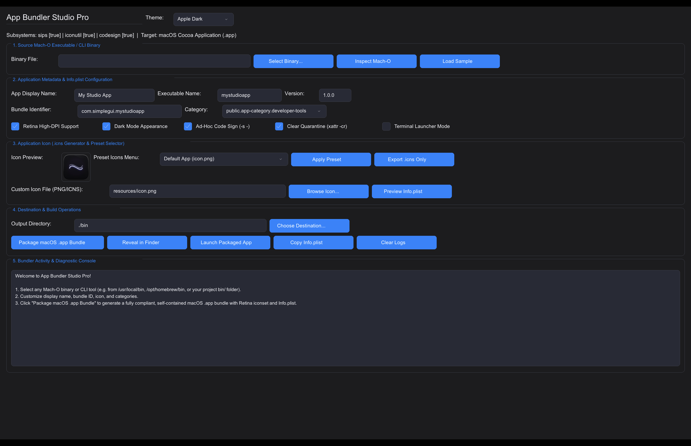
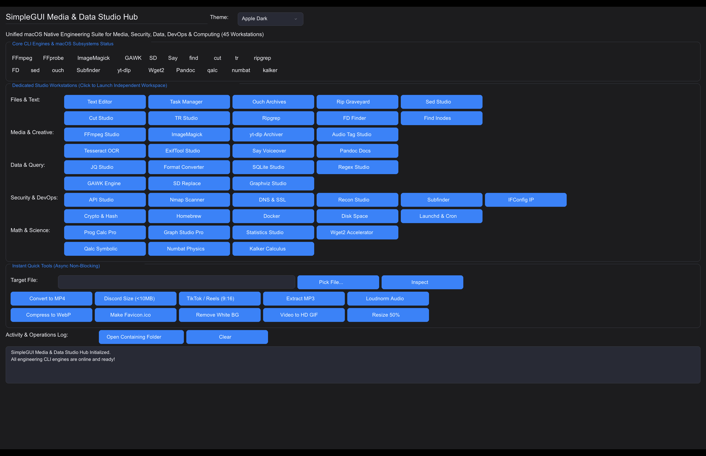
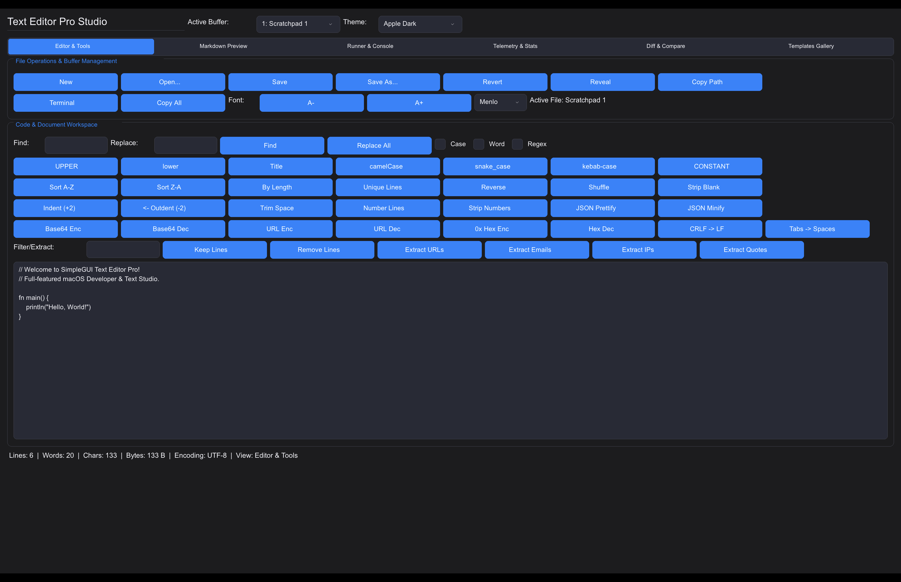
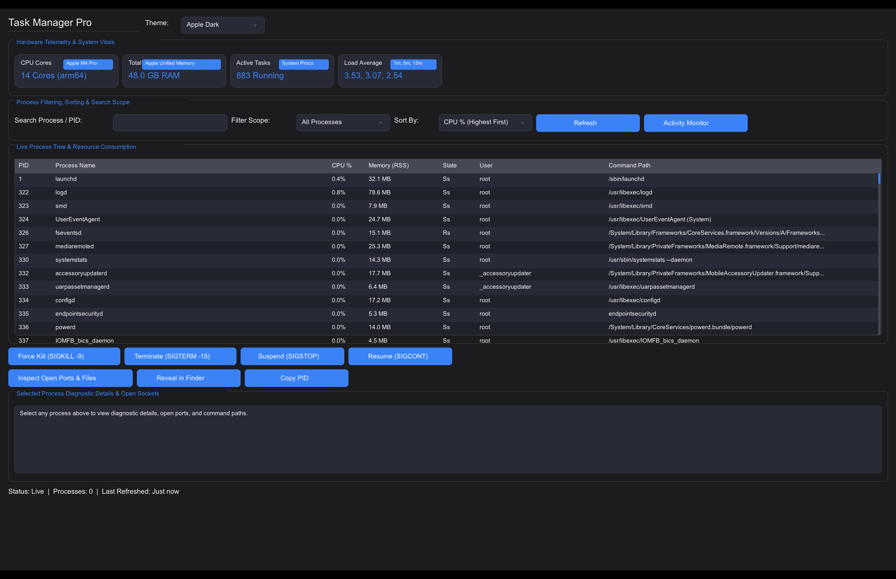

# `simple_gg` - Cross-Platform SimpleGUI for V

`simple_gg` is a lightweight, beginner-friendly UI framework for building native, hardware-accelerated desktop applications in V. Built on top of V's native `gg` graphics module (powered by Sokol), `simple_gg` delivers smooth performance and uniform UI rendering across **macOS, Linux, and Windows**without relying on external C/Obj-C dependencies.

---

# Visual Showcase & Snapshots of All Examples

<p align="center">
  
  
</p>
<p align="center">
  
  
</p>
<p align="center">
  
  
</p>

<details>
<summary><b> Click to view remaining example screenshots (19 more)</b></summary>
<br/>

<p align="center">
  
  
</p>
<p align="center">
  
  
</p>
<p align="center">
  
  
</p>
<p align="center">
  
  
</p>
<p align="center">
  
  
</p>
<p align="center">
  
  
</p>
<p align="center">
  
  
</p>
<p align="center">
  
  
</p>
<p align="center">
  
  
</p>

</details>

---

# Key Features

-  **Cross-Platform**: Runs natively on macOS, Linux, and Windows with native OS drag-and-drop support.
-  **17 Built-in Production Themes**: Apple Light/Dark, Nord, Dracula, Cyberpunk, Catppuccin Mocha, GitHub Dark/Light, Solarized, etc.
-  **RAD Development Controls Suite**: Multi-select Tag Input, Dual-Thumb Range Slider, Monospace Code Editor, File Drop Zone, Property Grid Inspector, Sparkline Micro-Charts, Pagination Bar, Resizable Split View, Toast Notification Overlay Stack, Command Palette (`Ctrl+K`), and Context Menus.
-  **Complete Widget Set**: ListBox (interactive single/multi select), ComboBox, Transfer List, Console Output Viewer, Color Palette Swatch Grid, Status Bar, Step Slider, text/password inputs, steppers, range sliders, toggle switches, checkboxes, dropdowns, segmented controls, rating stars, date pickers, metric cards, charts, tree views, data tables, breadcrumbs, avatars, status badges, accordions, and alert banners.
-  **Layout Engine**: Automatic vertical stacking, horizontal rows (`begin_row`), multi-column grids (`begin_grid`), flexboxes (`begin_flex_box`), tab containers, and group cards.
-  **Reactive State Management (`state.v`)**: Key-value reactive store (`set_state`, `get_state`), typed accessors, reactive state listeners (`on_state_change`), atomic crash-proof disk persistence (`save_app_state`, `load_app_state`), window session restoration (`save_window_session`, `restore_window_session`), and auto-save on close.
-  **OS & System Extensions (`sys.v`)**: Standardized user directory lookups for macOS (`~/Library`), Windows (`%APPDATA%`), and Linux (`$XDG_*`), path expansion with tilde (`~`) and environment variable resolution, native notifications, hardware metrics, process execution, clipboard, and file operations.
-  **Headless Console & RAD Toolkit (`simplecli`)**: Full-featured zero-window CLI framework with flag parsing, ANSI colors, tables, interactive prompts, multi-level logging, process control, hardware probing, and cryptography.
-  **V Standard Library Integrations (`stdlib.v`)**: Built-in fluent helpers for HTTP requests, RegEx matching, Cryptography (SHA256, MD5, AES, Bcrypt), Gzip/Zlib/Zstd compression, TOML parsing, SemVer checks, and WebSockets.
-  **Beginner Friendly**: Fluent chainable builder API with zero boilerplate.

---

# Quick Start

```v
module main

import simplegui

fn main() {
	mut win := simplegui.new_simple_window('My App', 520, 380)
	win.set_theme('Apple Dark')
	win.add_heading('SimpleGUI Starter')
	win.add_form_field('Name:', 'username', 'Ada Lovelace')
	win.add_checkbox('agree', 'I agree to the Terms', true)

	win.add_button('btn_save', 'Save')
	win.on_click('btn_save', fn (mut win simplegui.SimpleWindow) {
		println("User: ${win.get_text('username')}")
	})

	win.run()
}
```

---

# Beginner-Friendly Examples & Snapshots

The repository includes beginner-friendly example programs in the [`examples/`](examples) directory:

| Example | Description | Run Command | Snapshot |
| :--- | :--- | :--- | :--- |
| **[`01_quickstart.v`](examples/01_quickstart.v)**| First starter app with inputs and button callbacks. | `v run examples/01_quickstart.v` | [ Snapshot](snapshots/ex1.png) |
| **[`02_theme_gallery.v`](examples/02_theme_gallery.v)**| Live theme switcher across 34 production palettes. | `v run examples/02_theme_gallery.v` | [ Snapshot](snapshots/ex2.png) |
| **[`03_layout_containers.v`](examples/03_layout_containers.v)**| Horizontal rows, multi-column grids, and group cards. | `v run examples/03_layout_containers.v` | [ Snapshot](snapshots/ex3.png) |
| **[`04_widgets_and_forms.v`](examples/04_widgets_and_forms.v)**| Form inputs, sliders, steppers, ratings, dates, and metric cards. | `v run examples/04_widgets_and_forms.v` | [ Snapshot](snapshots/ex4.png) |
| **[`05_nameless_shortcuts.v`](examples/05_nameless_shortcuts.v)**| Rapid prototyping using nameless shortcuts (`win.input()`). | `v run examples/05_nameless_shortcuts.v` | [ Snapshot](snapshots/ex5.png) |
| **[`06_dashboard_app.v`](examples/06_dashboard_app.v)**| Real-world dashboard with KPI metrics, charts, and actions. | `v run examples/06_dashboard_app.v` | [ Snapshot](snapshots/ex6.png) |
| **[`07_advanced_controls.v`](examples/07_advanced_controls.v)**| Data tables, tab containers, tree views, search, breadcrumbs, avatars, and shortcuts. | `v run examples/07_advanced_controls.v` | [ Snapshot](snapshots/ex7.png) |
| **[`08_rad_development.v`](examples/08_rad_development.v)**| Rapid app builder with batch ops, JSON form export, clipboard, and OS dialogs. | `v run examples/08_rad_development.v` | [ Snapshot](snapshots/ex8.png) |
| **[`09_control_customization.v`](examples/09_control_customization.v)**| Custom geometry, margins/padding, colors, borders, and fluent control chaining. | `v run examples/09_control_customization.v` | [ Snapshot](snapshots/ex9.png) |
| **[`10_more_controls.v`](examples/10_more_controls.v)**| Icon buttons, toolbars, hyperlinks, checklists, chips, and password strength meter. | `v run examples/10_more_controls.v` | [ Snapshot](snapshots/ex10.png) |
| **[`11_data_table_pro.v`](examples/11_data_table_pro.v)**| Sortable data tables, wheel scrolling, row hover, and table manipulation. | `v run examples/11_data_table_pro.v` | [ Snapshot](snapshots/ex11.png) |
| **[`12_system_and_stdlib_features.v`](examples/12_system_and_stdlib_features.v)**| Desktop notifications, hardware specs, clipboard, system paths, HTTP GET, RegEx, Crypto. | `v run examples/12_system_and_stdlib_features.v` | [ Snapshot](snapshots/ex12.png) |
| **[`13_reactive_state_store.v`](examples/13_reactive_state_store.v)**| Reactive key-value state store, typed accessors, state change listeners, and JSON disk persistence. | `v run examples/13_reactive_state_store.v` | [ Snapshot](snapshots/ex13.png) |
| **[`14_rad_controls_showcase.v`](examples/14_rad_controls_showcase.v)**| RAD & Advanced Suite: ListBox, Multi-Select ListBox, ComboBox, Transfer List, Code Editor, Console Log, Color Palette, Step Slider, Status Bar, Tag Input, Range Slider, Drop Zone, Property Grid, Sparkline, Pagination, Split View, Toasts, Command Palette, Context Menu. | `v run examples/14_rad_controls_showcase.v` | [ Snapshot](snapshots/ex14.png) |
| **[`15_modern_ui_features_showcase.v`](examples/15_modern_ui_features_showcase.v)**| Modern UI Showcase: Window controls, themes, layouts, forms, state store, system utilities. | `v run examples/15_modern_ui_features_showcase.v` | [ Snapshot](snapshots/ex15.png) |
| **[`16_interval_timers.v`](examples/16_interval_timers.v)**| Interval Timers & Timeouts: Recurring timers, timeouts, clock, auto progress bar. | `v run examples/16_interval_timers.v` | [ Snapshot](snapshots/ex16.png) |
| **[`17_data_and_event_binding.v`](examples/17_data_and_event_binding.v)**| Data & Event Binding: Two-way state binding (`bind_state`), click aliases, shortcut bindings. | `v run examples/17_data_and_event_binding.v` | [ Snapshot](snapshots/ex17.png) |
| **[`18_custom_font_loading.v`](examples/18_custom_font_loading.v)**| Custom Font & Typography: Platform font resolution, custom TTF/OTF setting, font discovery. | `v run examples/18_custom_font_loading.v` | [ Snapshot](snapshots/ex18.png) |
| **[`19_cross_window_spy_and_automation.v`](examples/19_cross_window_spy_and_automation.v)**| Cross-Window Spy++ & Automation: Global window registry, control inspection, event bus. | `v run examples/19_cross_window_spy_and_automation.v` | [ Snapshot](snapshots/ex19.png) |
| **[`20_stdlib_data_structures_math_and_sockets.v`](examples/20_stdlib_data_structures_math_and_sockets.v)**| Collections, Math & Sockets: Stack, Queue, Set, MinHeap, BigInt, string distance metrics. | `v run examples/20_stdlib_data_structures_math_and_sockets.v` | [ Snapshot](snapshots/ex20.png) |
| **[`21_extended_os_system_calls.v`](examples/21_extended_os_system_calls.v)**| Extended OS & Hardware: CPU/memory pressure, environment variables, audio beeps, zip. | `v run examples/21_extended_os_system_calls.v` | [ Snapshot](snapshots/ex21.png) |
| **[`22_modern_super_controls_showcase.v`](examples/22_modern_super_controls_showcase.v)**| Super Controls Suite: Super Terminal, Code Studio, Smart Table, Kanban Board, Wizard Stepper, Floating Toolbar, Score Card, Sparklines, Donut Chart, Chip Input. | `v run examples/22_modern_super_controls_showcase.v` | [ Snapshot](snapshots/ex22.png) |
| **[`23_modern_image_controls_showcase.v`](examples/23_modern_image_controls_showcase.v)**| Modern Image Controls: User Profile Cards, Product Cards, Multi-Image Showcase Gallery, 3D App Launcher Tiles, Media Player Card, Hero Banners, and Hardware Texture Caching. | `v run examples/23_modern_image_controls_showcase.v` | [ Snapshot](snapshots/ex23.png) |
| **[`24_custom_image_dialogs_showcase.v`](examples/24_custom_image_dialogs_showcase.v)**| RAD Custom 3D Image Dialogs: 3D glossy icons (Success, Error, Warning, Info, Confirm, Danger, Security, Database, Cloud, Tip), 3-button actions, Checkboxes & Inline Input Prompts. | `v run examples/24_custom_image_dialogs_showcase.v` | [ Snapshot](snapshots/ex24.png) |
| **[`25_modern_ui_suite_and_ergonomics.v`](examples/25_modern_ui_suite_and_ergonomics.v)**| Modern UI Suite & Ergonomic Enhancements: Slide-over Drawer, Collapsible Nav Rail, Spline Area Chart, Activity Heatmap, Dynamic Flow Chips, Tree Grid, Month Calendar, Masked Inputs & Markdown Viewer. | `v run examples/25_modern_ui_suite_and_ergonomics.v` | [ Snapshot](snapshots/ex25.png) |
| **[`26_simplecli_system_monitor.v`](examples/26_simplecli_system_monitor.v)**| SimpleCLI Headless System Monitor: CPU/RAM/Disk metrics, load averages, battery status, ASCII tables & panels. | `v run examples/26_simplecli_system_monitor.v` | Console CLI |
| **[`27_simplecli_rad_interactive_tool.v`](examples/27_simplecli_rad_interactive_tool.v)**| SimpleCLI Interactive RAD Wizard: Banners, selects, multi-selects, prompts, progress bars & state persistence. | `v run examples/27_simplecli_rad_interactive_tool.v` | Console CLI |
| **[`28_simplecli_process_and_automation.v`](examples/28_simplecli_process_and_automation.v)**| SimpleCLI Process & Task Automation: Command timeouts, retry loops, AES encryption, clipboard & desktop alerts. | `v run examples/28_simplecli_process_and_automation.v` | Console CLI |

---

# `simplecli` - Headless Console & RAD Toolkit (Zero GUI Dependencies)

Need all the power of OS system calls, process management, hardware monitoring, desktop alerts, speech synthesis, standard paths, and stdlib crypto/HTTP without spinning up a graphical window? Use `import simplecli`!

```v
module main

import simplecli

fn main() {
	mut app := simplecli.new_app('DeployCLI', '1.0.0')
	app.banner('DeployCLI Workspace', 'v1.0.0')

	// System metrics & paths
	cpu := app.get_cpu_info()
	ram := app.get_memory_info()
	app.print_kv({ 'CPU': cpu, 'RAM': ram })

	// Interactive RAD prompts & tables
	env := app.select('Target environment', ['dev', 'staging', 'prod'])
	app.success('Selected ${env}')

	// Desktop notification
	app.notify('Ready', 'DeployCLI initialized.')
}
```

See [CLI_API.md](CLI_API.md) for the complete SimpleCLI documentation and API reference.

---

# 💻 Production Console Applications Suite (`cli_apps/`)

`simple_gg` includes 4 production-grade, zero-window command-line applications in the [`cli_apps/`](cli_apps) directory:

| Application | Command | Description |
| :--- | :--- | :--- |
| **DevOps Sentinel** | `v run cli_apps/devops_sentinel.v` | System health guardian & TCP port monitor (PostgreSQL, Redis, MySQL, HTTP). |
| **Vault Backup Manager** | `v run cli_apps/vault_backup_manager.v` | Enterprise-grade AES-256 encrypted directory backup with SHA-256 checksums. |
| **API Stress Bench** | `v run cli_apps/api_stress_bench.v` | High-throughput HTTP API load benchmarker with latency stats (Mean, Median, RMS). |
| **Git Workspace Pilot** | `v run cli_apps/multirepo_git_pilot.v` | Multi-repository Git orchestrator with parallel fetch and dirty worktree tables. |

See the [`cli_apps/README.md`](cli_apps/README.md) for detailed usage guides and CLI flag options.

---

# Production Workstations & Studio Applications (44 Workstations)

`simple_gg` includes 44 desktop applications in the [`applications/`](applications) directory, covering devtools, media studios, network utilities, data converters, and security workstations:

<p align="center">
  
  
</p>
<p align="center">
  
  
</p>

| Application | Category | Description | Run Command | Snapshot |
| :--- | :--- | :--- | :--- | :--- |
| **[`app_bundler_studio.v`](applications/app_bundler_studio.v)** | DevTools | macOS .app bundler, Retina .icns generator & packager. | `v run applications/app_bundler_studio.v` | [Screenshot](snapshots/apps/app_bundler_studio.png) |
| **[`api_studio.v`](applications/api_studio.v)** | DevTools | Modern API testing client & HTTP request builder. | `v run applications/api_studio.v` | [Screenshot](snapshots/apps/api_studio.png) |
| **[`media_studio_hub.v`](applications/media_studio_hub.v)** | Media | Master workstation with instant one-click media tools. | `v run applications/media_studio_hub.v` | [Screenshot](snapshots/apps/media_studio_hub.png) |
| **[`ffmpeg_studio.v`](applications/ffmpeg_studio.v)** | Media | Video/audio encoding, trimming, and format transcoding. | `v run applications/ffmpeg_studio.v` | [Screenshot](snapshots/apps/ffmpeg_studio.png) |
| **[`sqlite_studio.v`](applications/sqlite_studio.v)** | Database | Interactive SQLite schema inspector & query executor. | `v run applications/sqlite_studio.v` | [Screenshot](snapshots/apps/sqlite_studio.png) |
| **[`docker_studio.v`](applications/docker_studio.v)** | DevOps | Container inspector, logs viewer, and lifecycle manager. | `v run applications/docker_studio.v` | [Screenshot](snapshots/apps/docker_studio.png) |
| **[`task_manager.v`](applications/task_manager.v)** | System | Real-time process monitor with CPU/memory telemetry. | `v run applications/task_manager.v` | [Screenshot](snapshots/apps/task_manager.png) |
| **[`text_editor.v`](applications/text_editor.v)** | Productivity | Full-featured code & markdown text editor. | `v run applications/text_editor.v` | [Screenshot](snapshots/apps/text_editor.png) |
| **[`regex_studio.v`](applications/regex_studio.v)** | DevTools | Real-time regular expression tester with capture groups. | `v run applications/regex_studio.v` | [Screenshot](snapshots/apps/regex_studio.png) |
| **[`imagemagick_studio.v`](applications/imagemagick_studio.v)** | Media | Batch image manipulation, resizing, and filters. | `v run applications/imagemagick_studio.v` | [Screenshot](snapshots/apps/imagemagick_studio.png) |
| **[`nmap_studio.v`](applications/nmap_studio.v)** | Security | Network security scanner & port analyzer. | `v run applications/nmap_studio.v` | [Screenshot](snapshots/apps/nmap_studio.png) |
| **[`brew_studio.v`](applications/brew_studio.v)** | Package Mgr | Homebrew package browser, installer, and updater. | `v run applications/brew_studio.v` | [Screenshot](snapshots/apps/brew_studio.png) |
| ... *(32 more)* | Various | See complete visual gallery & catalog in [`applications/README.md`](applications/README.md). | | [All Snapshots](applications/README.md) |

---

# Security & Safe Execution Engine

`simple_gg` features a hardened system execution framework (`simplegui/security.v`) designed to prevent shell injection, command poisoning, and path traversal attacks across all platforms:

- **POSIX Single-Quote Escaping (`simplegui.quote_arg`, `simplegui.quote_path`)**: Wraps and escapes user input safely, neutralizing quotes, semicolons, backticks, dollar signs, and redirection operators.
- **Safe Subshell Execution (`simplegui.exec_safe(tool, args)`)**: Automatically quotes all arguments and executes binaries without vulnerability to command injection.
- **Safe Stdin Pipe Execution (`simplegui.exec_safe_stdin(tool, args, input_data)`)**: Safely pipes arbitrary data over standard input without shell exposure.
- **Filename Sanitization (`simplegui.sanitize_filename(name)`)**: Strips path separators (`/`, `\`), null bytes, and traversal tokens (`..`).

---

# Documentation

- **Full API Guide (GUI)**: See [API.md](API.md) for complete details on window configuration, controls, layout engine, themes, event callbacks, reactive state management (`state.v`), system calls (`sys.v`), and standard library extensions (`stdlib.v`).
- **SimpleCLI Reference (Headless & Console)**: See [CLI_API.md](CLI_API.md) for complete details on the zero-window console utility framework, flag parsing, ANSI UI, interactive prompts, process management, hardware metrics, and stdlib utilities.
- **Workstations Catalog**: See [applications/README.md](applications/README.md) for the complete list & visual showcase of 44 desktop applications.
- **Examples Guide**: See [examples/README.md](examples/README.md) for detailed descriptions of all example scripts.


