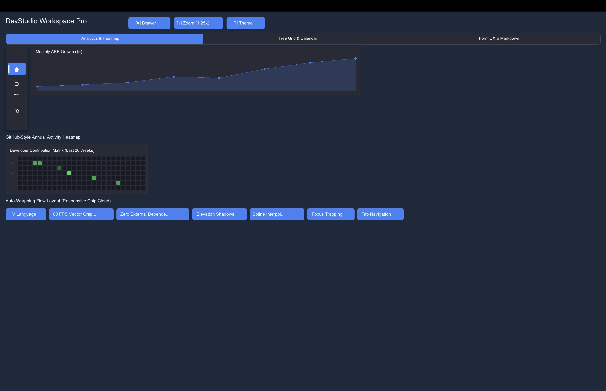

# SimpleGUI (`simple_gg`) Example Demos & Screenshots

This directory contains beginner-friendly, well-commented examples demonstrating the entire `simplegui` cross-platform API built on V's `gg` graphics module.

---

### 🎨 Visual Showcase & Snapshots

<p align="center">
  
  
</p>
<p align="center">
  
  
</p>
<p align="center">
  
  
</p>

<details>
<summary><b>📸 Click to view remaining example screenshots (19 more)</b></summary>
<br/>

<p align="center">
  
  
</p>
<p align="center">
  
  
</p>
<p align="center">
  
  
</p>
<p align="center">
  
  
</p>
<p align="center">
  
  
</p>
<p align="center">
  
  
</p>
<p align="center">
  
  
</p>
<p align="center">
  
  
</p>
<p align="center">
  
  
</p>

</details>

---

## 📁 Examples Included

| Example File                                                           | Description                      | Features Covered                                                                                                                                          | Snapshot                               |
| :--------------------------------------------------------------------- | :------------------------------- | :-------------------------------------------------------------------------------------------------------------------------------------------------------- | :------------------------------------- |
| **[`01_quickstart.v`](01_quickstart.v)**                               | Beginner starter app             | Window creation, theme, form fields, checkbox, buttons, click callbacks.                                                                                  | [📸 Snapshot](../snapshots/ex1.png)   |
| **[`02_theme_gallery.v`](02_theme_gallery.v)**                         | Theme gallery & switcher         | Live dropdown selector to switch themes dynamically across 17 production palettes.                                                                        | [📸 Snapshot](../snapshots/ex2.png)   |
| **[`03_layout_containers.v`](03_layout_containers.v)**                 | Layout & Group containers        | Horizontal rows (`begin_row`), multi-column grids (`begin_grid`), and group cards.                                                                        | [📸 Snapshot](../snapshots/ex3.png)   |
| **[`04_widgets_and_forms.v`](04_widgets_and_forms.v)**                 | Form component gallery           | Form inputs, password field, number stepper, range slider, toggle switch, rating stars, date picker, progress bar, metric cards, alert banner.            | [📸 Snapshot](../snapshots/ex4.png)   |
| **[`05_nameless_shortcuts.v`](05_nameless_shortcuts.v)**               | Rapid prototyping                | Nameless control shortcuts (`win.input()`, `win.checkbox()`, `win.number()`, `win.button()`).                                                             | [📸 Snapshot](../snapshots/ex5.png)   |
| **[`06_dashboard_app.v`](06_dashboard_app.v)**                         | Interactive dashboard app        | Multi-column metric KPI cards, polyline trend charts, environment settings, region dropdown, deployment callbacks.                                        | [📸 Snapshot](../snapshots/ex6.png)   |
| **[`07_advanced_controls.v`](07_advanced_controls.v)**                 | Advanced UI controls & shortcuts | Data tables, tab containers, tree views, search bar, breadcrumbs, avatars, status badges, accordions, and window close hooks.                             | [📸 Snapshot](../snapshots/ex7.png)   |
| **[`08_rad_development.v`](08_rad_development.v)**                     | RAD application builder          | Batch field reading/clearing, JSON export, control enable/disable, OS notifications, clipboard access, and native confirm boxes.                          | [📸 Snapshot](../snapshots/ex8.png)   |
| **[`09_control_customization.v`](09_control_customization.v)**         | Control customization & geometry | Explicit sizing, padding/margins, custom font sizes/colors/borders, corner radius, tooltips, and fluent `win.control()` chaining.                         | [📸 Snapshot](../snapshots/ex9.png)   |
| **[`10_more_controls.v`](10_more_controls.v)**                         | More window UI controls          | Icon buttons, toolbars, hyperlinks, dropdown menu buttons, multi-select checklists, chip/tag groups, time pickers, and a live password strength meter.    | [📸 Snapshot](../snapshots/ex10.png)  |
| **[`11_data_table_pro.v`](11_data_table_pro.v)**                       | Data table pro                   | Sortable columns (click header, numeric-aware compare), mouse-wheel scrolling for fixed-height tables, row hover highlight, and row add/remove/sort APIs. | [📸 Snapshot](../snapshots/ex11.png)  |
| **[`12_system_and_stdlib_features.v`](12_system_and_stdlib_features.v)** | System calls & stdlib toolkit    | Desktop notifications, hardware specs (CPU/RAM/cores), clipboard read/write, system paths, HTTP GET, RegEx, SHA256 crypto, and random password generator. | [📸 Snapshot](../snapshots/ex12.png)  |
| **[`13_reactive_state_store.v`](13_reactive_state_store.v)**           | Reactive state & persistence     | Key-value state store, typed accessors (`int`/`bool`), reactive state listeners (`on_state_change`), and JSON disk serialization/restoration.             | [📸 Snapshot](../snapshots/ex13.png)  |
| **[`14_rad_controls_showcase.v`](14_rad_controls_showcase.v)**         | RAD controls suite               | ListBox, Multi-Select, ComboBox, Transfer List, Code Editor, Console Log, Color Palette, Step Slider, Status Bar, Property Grid, Sparklines, Toasts.      | [📸 Snapshot](../snapshots/ex14.png)  |
| **[`15_modern_ui_features_showcase.v`](15_modern_ui_features_showcase.v)** | Modern UI showcase               | Complete showcase of window controls, themes, layout flex containers, form inputs, reactive state, system toolkit.                                         | [📸 Snapshot](../snapshots/ex15.png)  |
| **[`16_interval_timers.v`](16_interval_timers.v)**                     | Interval timers & timeouts       | Recurring timers (`set_interval`), one-shot delays (`set_timeout`), clock polling, auto-incrementing progress, and timer control APIs.                    | [📸 Snapshot](../snapshots/ex16.png)  |
| **[`17_data_and_event_binding.v`](17_data_and_event_binding.v)**       | Two-way data & event binding     | Control-to-state binding (`bind_state`), fluent event aliases (`bind_click`), keyboard key & shortcut binding (`bind_key`, `bind_shortcut`).               | [📸 Snapshot](../snapshots/ex17.png)  |
| **[`18_custom_font_loading.v`](18_custom_font_loading.v)**             | Custom font & typography        | Platform font resolution (`simplegui.resolve_window_font_path`), custom TTF/OTF setting (`win.set_font_path`), macOS/Linux font discovery & env overrides. | [📸 Snapshot](../snapshots/ex18.png)  |
| **[`19_cross_window_spy_and_automation.v`](19_cross_window_spy_and_automation.v)** | Cross-Window Spy++ & Automation | Global window registry (`sys_register_window`), control inspection (`sys_spy_window`), live event bus, external macOS app scanning. | [📸 Snapshot](../snapshots/ex19.png)  |
| **[`20_stdlib_data_structures_math_and_sockets.v`](20_stdlib_data_structures_math_and_sockets.v)** | Collections, Math & Sockets | Generic Stack, Queue, Set, MinHeap, BigInt, Complex math, string distance metrics (Levenshtein, Jaro-Winkler), thread sync (Mutex/WaitGroup). | [📸 Snapshot](../snapshots/ex20.png)  |
| **[`21_extended_os_system_calls.v`](21_extended_os_system_calls.v)**     | Extended OS & Hardware Subsystem | Live CPU & Memory pressure metrics, environment variables, system audio beeps, speech synthesis, temp files & zip archives. | [📸 Snapshot](../snapshots/ex21.png)  |
| **[`22_modern_super_controls_showcase.v`](22_modern_super_controls_showcase.v)** | Modern Super Controls Suite      | Super Terminal, Code Studio, Smart Table, Kanban Board, Wizard Stepper, Floating Toolbar, Score Card, Sparklines, Donut Chart, Chip Input. | [📸 Snapshot](../snapshots/ex22.png)  |
| **[`23_modern_image_controls_showcase.v`](23_modern_image_controls_showcase.v)** | Modern Image Super Controls      | User Profile Cards, Product Cards, Multi-Image Showcase Gallery, 3D App Launcher Tiles, Media Player Card, Hero Banners, and GPU Texture Caching. | [📸 Snapshot](../snapshots/ex23.png)  |
| **[`24_custom_image_dialogs_showcase.v`](24_custom_image_dialogs_showcase.v)**   | RAD Custom 3D Image Dialogs      | Custom 3D glowing dialog icons (Success, Error, Warning, Info, Confirm, Danger, Security, Database, Cloud, Tip), 3-button actions, Checkboxes & Inline Input Prompts. | [📸 Snapshot](../snapshots/ex24.png)  |
| **[`25_modern_ui_suite_and_ergonomics.v`](25_modern_ui_suite_and_ergonomics.v)** | Modern UI Suite & Ergonomics     | Slide-over Drawer, Collapsible Nav Rail, Spline Area Chart, Activity Heatmap, Dynamic Flow Chips, Tree Grid, Month Calendar, Masked Inputs & Markdown Viewer. | [📸 Snapshot](../snapshots/ex25.png)  |
| **[`26_simplecli_system_monitor.v`](26_simplecli_system_monitor.v)** | SimpleCLI Headless System Monitor | Hardware specs, CPU/RAM/Disk usage, load averages, battery telemetry, ASCII tables, and standard path resolution. | Console Utility |
| **[`27_simplecli_rad_interactive_tool.v`](27_simplecli_rad_interactive_tool.v)** | SimpleCLI Interactive RAD Wizard  | Interactive terminal prompts, single/multi select choices, confirmation prompts, progress bar animations, and JSON state persistence. | Console Utility |
| **[`28_simplecli_process_and_automation.v`](28_simplecli_process_and_automation.v)** | SimpleCLI Process & Task Automation | Process execution with timeouts and retries, AES-256 encryption, clipboard read/write, audio beeps, and desktop notifications. | Console Utility |

---

## 🚀 How to Run the Demos

```bash
# Run Quickstart Demo
v run examples/01_quickstart.v

# Run Theme Gallery Demo
v run examples/02_theme_gallery.v

# Run Layout Containers Demo
v run examples/03_layout_containers.v

# Run Component Gallery Demo
v run examples/04_widgets_and_forms.v

# Run Nameless Shortcuts Demo
v run examples/05_nameless_shortcuts.v

# Run Interactive Dashboard Demo
v run examples/06_dashboard_app.v

# Run Advanced Controls Demo
v run examples/07_advanced_controls.v

# Run RAD Application Builder Demo
v run examples/08_rad_development.v

# Run Control Customization & Geometry Demo
v run examples/09_control_customization.v

# Run More Window UI Controls Demo
v run examples/10_more_controls.v

# Run Data Table Pro Demo
v run examples/11_data_table_pro.v

# Run System & Stdlib Toolkit Demo
v run examples/12_system_and_stdlib_features.v

# Run Reactive State Store Demo
v run examples/13_reactive_state_store.v

# Run RAD Controls Suite Showcase Demo
v run examples/14_rad_controls_showcase.v

# Run Modern UI Features Showcase Demo
v run examples/15_modern_ui_features_showcase.v

# Run Interval Timers & Timeouts Showcase Demo
v run examples/16_interval_timers.v

# Run Two-Way Data & Event Binding Demo
v run examples/17_data_and_event_binding.v

# Run Custom Font Loading & Typography Demo
v run examples/18_custom_font_loading.v

# Run Cross-Window Spy++ & Automation Demo
v run examples/19_cross_window_spy_and_automation.v

# Run Stdlib Collections & Math Demo
v run examples/20_stdlib_data_structures_math_and_sockets.v

# Run Extended OS & Hardware Subsystem Demo
v run examples/21_extended_os_system_calls.v

# Run Modern Super Controls Suite Showcase Demo
v run examples/22_modern_super_controls_showcase.v

# Run Modern Image Controls & Asset Gallery Showcase Demo
v run examples/23_modern_image_controls_showcase.v

# Run RAD Custom 3D Image Dialogs Showcase Demo
v run examples/24_custom_image_dialogs_showcase.v

# Run Modern UI Suite & Ergonomic Enhancements Demo
v run examples/25_modern_ui_suite_and_ergonomics.v
```

